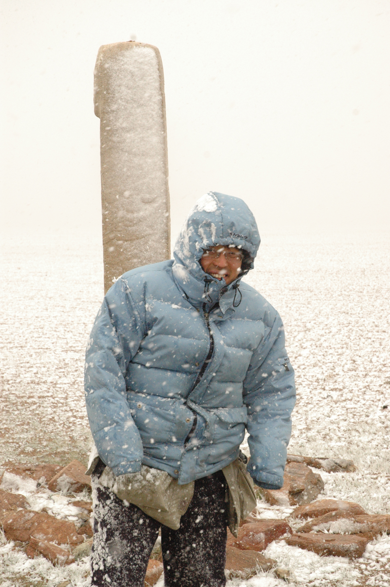

📄 몽골 푸른늑대의 후예 AI 메타버스 전시장 개발 보고서
다큐멘터리 사진가 강종진의 몽골 푸른늑대의 후예
AI 메타버스 전시장 개발 프로젝트
프로젝트명: 끝없는 지평선 너머 - Beyond the Endless Horizon
개발 기간: 2025.12.26 ~ 2025.12.27 (v0.2)
개발자: ucon@UCON-Linux
사진작가: 강종진
프로젝트 유형: 3D Web Gallery with AI Docent System

📑 목차
프로젝트 개요
기술 아키텍처
핵심 기술 구현
AI 도슨트 시스템
개발 환경 및 배포
사용자 경험 설계
성과 및 향후 계획
1. 프로젝트 개요
1.1 배경 및 목적
다큐멘터리 사진가 강종진 작가는 몽골 대초원에서 유목민의 삶과 자연을 담은 32점의 사진 작품을 보유하고 있습니다. 본 프로젝트는 이러한 작품들을 3D 메타버스 공간에서 관람할 수 있는 혁신적인 디지털 전시 플랫폼을 구축하는 것을 목표로 합니다.

프로젝트 목표
몰입형 3D 갤러리: 실제 전시장을 방문하는 듯한 경험 제공
AI 도슨트 시스템: 각 작품마다 AI 음성 해설 제공
접근성: 웹 브라우저로 언제 어디서나 접속 가능
확장성: 향후 다른 작가/전시로 확장 가능한 구조
1.2 작품 구성
총 32점의 사진 작품

주제: 몽골 유목민의 일상, 야생 동물, 대자연 풍경
특징: 다큐멘터리 스타일의 사실적 묘사
핵심 작품:
012번: "한 때 한 곳을 스쳐간 사계" (눈보라 속 양떼 구출)
005번: "야생마 생포작전" (질주하는 야생마와 유목민)
009번: "유목민의 이사" (연 30회 이동하는 게르)
025번: "졸업을 맞은 몽골의 어린이들" (초원의 졸업식)
019번: "동화속의 부족 차탄족 사람들" (러시아 국경 순록 유목민)
1.3 핵심 혁신 요소
AI 기술 통합
AI 음성 합성: ElevenLabs/MiniMax TTS로 자연스러운 한국어 해설
AI 가이드 캐릭터: 강종진 작가 본인이 도슨트로 등장
맞춤형 해설: 각 작품의 스토리와 촬영 배경 전달
메타버스 경험
360도 탐색: 자유로운 시점 이동
인터랙티브 요소: 작품 클릭, 확대, 도슨트 창 열기
공간 설계: 몽골 대초원을 모티브로 한 배경
2. 기술 아키텍처
2.1 시스템 구성도
┌─────────────────────────────────────────────────────────────┐
│                     사용자 웹 브라우저                        │
│  ┌───────────┐  ┌───────────┐  ┌───────────┐              │
│  │   HTML5   │  │   CSS3    │  │JavaScript │              │
│  └─────┬─────┘  └─────┬─────┘  └─────┬─────┘              │
│        └────────────────┴──────────────┘                    │
└─────────────────────────┬───────────────────────────────────┘
                          │
                          ▼
┌─────────────────────────────────────────────────────────────┐
│                    프론트엔드 레이어                          │
│  ┌─────────────────┐  ┌─────────────────┐                 │
│  │   Three.js       │  │   WebGL         │                 │
│  │   (3D 렌더링)    │  │   (GPU 가속)    │                 │
│  └─────────────────┘  └─────────────────┘                 │
│                                                             │
│  ┌─────────────────────────────────────────────────────┐  │
│  │            main_v16.js (핵심 로직)                   │  │
│  │  - 씬 생성 및 관리                                    │  │
│  │  - 작품 프레임 생성                                   │  │
│  │  - 스피커 아이콘 렌더링                               │  │
│  │  - 이벤트 처리 (더블클릭, 드래그)                     │  │
│  │  - 도슨트 시스템                                      │  │
│  └─────────────────────────────────────────────────────┘  │
└─────────────────────────┬───────────────────────────────────┘
                          │
                          ▼
┌─────────────────────────────────────────────────────────────┐
│                    백엔드 레이어                             │
│  ┌──────────────┐  ┌──────────────┐  ┌──────────────┐    │
│  │   Nginx      │  │   Docker     │  │   Ubuntu     │    │
│  │  (웹서버)    │  │  (컨테이너)  │  │   20.04      │    │
│  └──────────────┘  └──────────────┘  └──────────────┘    │
│                                                             │
│  서버 경로:                                                 │
│  /var/www/monggol/        ← 배포 폴더                      │
│  /home/ucon/monggol/      ← 개발 폴더                      │
└─────────────────────────────────────────────────────────────┘
                          │
                          ▼
┌─────────────────────────────────────────────────────────────┐
│                    스토리지 레이어                           │
│  ┌──────────────┐  ┌──────────────┐  ┌──────────────┐    │
│  │  이미지 저장 │  │  오디오 저장 │  │  GitHub      │    │
│  │  (JPG 32장)  │  │  (MP3 5개)   │  │  (코드 관리) │    │
│  └──────────────┘  └──────────────┘  └──────────────┘    │
└─────────────────────────────────────────────────────────────┘
2.2 기술 스택
프론트엔드
기술	버전	역할
Three.js	r128+	3D 그래픽 렌더링 엔진
WebGL	2.0	GPU 가속 그래픽 처리
JavaScript	ES6+	클라이언트 로직
HTML5	-	구조 및 마크업
CSS3	-	스타일링 및 애니메이션
백엔드 & 인프라
기술	버전	역할
Nginx	1.18+	웹 서버
Docker	20.10+	컨테이너화
Ubuntu Linux	20.04 LTS	운영체제
Git	2.25+	버전 관리
AI 음성 합성
서비스	모델	용도
ElevenLabs	v3-tts	고품질 음성 합성
MiniMax	speech-2.6-hd	한국어 음성 합성
2.3 데이터 구조
파일 시스템 구조
/home/ucon/monggol/
├── index.html              # 메인 페이지
├── build.sh                # 배포 스크립트
├── docker-compose.yml      # Docker 설정
│
├── js/
│   ├── main_v16.js         # 핵심 로직 (1740줄)
│   └── three.min.js        # Three.js 라이브러리
│
├── css/
│   ├── style.css           # 메인 스타일
│   └── popup.css           # 도슨트 팝업 스타일
│
├── images/
│   ├── artworks/           # 작품 이미지 (001~032.jpg)
│   ├── background/         # 배경 이미지
│   │   ├── khuvsgul_lake.jpg
│   │   └── khuvsgul_sky_only.jpg
│   └── author_profile_XXX.jpg  # 도슨트 프로필 (5개)
│
├── audio/
│   ├── docent_intro.mp3    # 인사말
│   ├── docent_012.mp3      # 작품별 해설
│   ├── docent_005.mp3
│   ├── docent_009.mp3
│   ├── docent_025.mp3
│   └── docent_019.mp3
│
├── data/
│   └── artworks.json       # 작품 메타데이터
│
└── src/                    # 소스 코드 (개발용)
    ├── index.html
    ├── js/
    ├── css/
    ├── images/
    └── audio/
작품 데이터 구조 (JavaScript)
Copyconst data = {
    '012': {
        title: '한 때 한 곳을 스쳐간 사계',
        description: `검푸르게 화창하던 하늘에서 산을 하나 넘어서자
        갑자기 눈보라가 휘몰아쳤다...`,
        audio: 'audio/artwork_012_commentary.mp3'
    },
    '005': {
        title: '야생마 생포작전',
        description: `지평선 위로 먼지구름이 피어오르고...`,
        audio: 'audio/docent_005.mp3'
    }
    // ... 나머지 작품
};
3. 핵심 기술 구현
3.1 Three.js 기반 3D 갤러리
3D 씬 구성
Copy// 1. 씬 초기화
const scene = new THREE.Scene();
scene.background = new THREE.Color(0x87ceeb); // 하늘색

// 2. 카메라 설정
const camera = new THREE.PerspectiveCamera(
    75,                                    // FOV
    window.innerWidth / window.innerHeight, // 종횡비
    0.1,                                   // Near plane
    1000                                   // Far plane
);
camera.position.set(0, 1.6, 5); // 사람 시점 높이

// 3. 렌더러 생성
const renderer = new THREE.WebGLRenderer({ 
    antialias: true,  // 안티앨리어싱
    alpha: true       // 투명 배경
});
renderer.setSize(window.innerWidth, window.innerHeight);
renderer.shadowMap.enabled = true; // 그림자 활성화
작품 프레임 생성 (핵심 알고리즘)
Copy// 32개 작품을 원형 배치
const artworkCount = 32;
const radius = 15; // 반지름

for (let i = 0; i < artworkCount; i++) {
    const angle = (i / artworkCount) * Math.PI * 2; // 각도 계산
    const x = Math.cos(angle) * radius;
    const z = Math.sin(angle) * radius;
    
    // 프레임 그룹 생성
    const frameGroup = new THREE.Group();
    
    // 1. 작품 이미지 로드
    const imgNum = String(i + 1).padStart(3, '0'); // 001, 002, ...
    const texture = textureLoader.load(`images/artworks/${imgNum}.jpg`);
    
    // 2. 이미지 평면 생성
    const geometry = new THREE.PlaneGeometry(2, 1.5);
    const material = new THREE.MeshBasicMaterial({ 
        map: texture,
        side: THREE.DoubleSide 
    });
    const mesh = new THREE.Mesh(geometry, material);
    
    // 3. 액자 테두리 추가
    const frameGeometry = new THREE.BoxGeometry(2.1, 1.6, 0.1);
    const frameMaterial = new THREE.MeshStandardMaterial({ 
        color: 0xd4af37, // 골드
        metalness: 0.8,
        roughness: 0.2
    });
    const frame = new THREE.Mesh(frameGeometry, frameMaterial);
    
    // 4. 작품 ID 저장 (이벤트 처리용)
    frameGroup.userData.artworkId = imgNum;
    
    // 5. 위치 및 회전 설정
    frameGroup.position.set(x, 1.5, z);
    frameGroup.lookAt(0, 1.5, 0); // 중앙을 향하도록
    
    // 6. 씬에 추가
    frameGroup.add(mesh);
    frameGroup.add(frame);
    scene.add(frameGroup);
}
3.2 스피커 아이콘 시스템
Canvas 기반 동적 텍스처 생성
Copy// 도슨트가 있는 작품에만 스피커 아이콘 표시
if (imgNum === "012" || imgNum === "005" || 
    imgNum === "009" || imgNum === "025" || imgNum === "019") {
    
    // 1. Canvas 생성
    const canvas = document.createElement('canvas');
    canvas.width = 128;
    canvas.height = 128;
    const ctx = canvas.getContext('2d');
    
    // 2. 배경 원 그리기
    ctx.fillStyle = 'rgba(212, 175, 55, 0.9)'; // 반투명 골드
    ctx.beginPath();
    ctx.arc(64, 64, 60, 0, Math.PI * 2);
    ctx.fill();
    
    // 3. 스피커 이모지 렌더링
    ctx.font = 'bold 80px Arial';
    ctx.textAlign = 'center';
    ctx.textBaseline = 'middle';
    ctx.fillStyle = 'white';
    ctx.fillText('🔊', 64, 64);
    
    // 4. Canvas를 Three.js 텍스처로 변환
    const texture = new THREE.CanvasTexture(canvas);
    texture.needsUpdate = true;
    
    // 5. Sprite 생성 (항상 카메라를 향함)
    const material = new THREE.SpriteMaterial({ 
        map: texture,
        transparent: true
    });
    const sprite = new THREE.Sprite(material);
    sprite.scale.set(0.5, 0.5, 1);
    sprite.position.set(0, 1.3, 0); // 작품 위쪽
    
    // 6. 프레임 그룹에 추가
    frameGroup.add(sprite);
    
    console.log(`✅ ${imgNum}번 스피커 아이콘 추가`);
}
기술적 특징
Canvas API: 동적 그래픽 생성
CanvasTexture: 실시간 텍스처 업데이트
Sprite: 항상 카메라를 향하는 빌보드 효과
투명도 처리: Alpha 채널로 자연스러운 합성
3.3 인터랙션 시스템
마우스 기반 카메라 컨트롤
Copylet isDragging = false;
let previousMouseX = 0;
let previousMouseY = 0;
let cameraAngleH = 0;  // 수평 회전각
let cameraAngleV = 0.1; // 수직 회전각

// 마우스 다운
canvas.addEventListener('mousedown', (event) => {
    isDragging = true;
    previousMouseX = event.clientX;
    previousMouseY = event.clientY;
});

// 마우스 이동 (드래그)
canvas.addEventListener('mousemove', (event) => {
    if (!isDragging) return;
    
    const deltaX = event.clientX - previousMouseX;
    const deltaY = event.clientY - previousMouseY;
    
    // 수평 회전
    cameraAngleH -= deltaX * 0.005;
    
    // 수직 회전 (제한: -45° ~ 45°)
    cameraAngleV += deltaY * 0.005;
    cameraAngleV = Math.max(-0.8, Math.min(0.8, cameraAngleV));
    
    // 카메라 위치 업데이트
    camera.position.x = Math.sin(cameraAngleH) * 5;
    camera.position.z = Math.cos(cameraAngleH) * 5;
    camera.position.y = 1.6 + cameraAngleV * 2;
    camera.lookAt(0, 1.5, 0);
    
    previousMouseX = event.clientX;
    previousMouseY = event.clientY;
});

// 마우스 업
canvas.addEventListener('mouseup', () => {
    isDragging = false;
});
Raycasting 기반 작품 선택
Copyconst raycaster = new THREE.Raycaster();
const mouse = new THREE.Vector2();

canvas.addEventListener('dblclick', (event) => {
    // 1. 마우스 좌표를 정규화 (-1 ~ 1)
    mouse.x = (event.clientX / window.innerWidth) * 2 - 1;
    mouse.y = -(event.clientY / window.innerHeight) * 2 + 1;
    
    // 2. Raycaster 설정
    raycaster.setFromCamera(mouse, camera);
    
    // 3. 교차 검사
    const intersects = raycaster.intersectObjects(scene.children, true);
    
    if (intersects.length > 0) {
        const object = intersects[0].object;
        
        // 4. 작품 ID 추출
        let parent = object;
        while (parent && !parent.userData.artworkId) {
            parent = parent.parent;
        }
        
        if (parent && parent.userData.artworkId) {
            const artworkId = parent.userData.artworkId;
            console.log('🎨 더블클릭:', artworkId);
            
            // 5. 도슨트 창 열기
            if (data[artworkId]) {
                window.openDoc(artworkId);
            }
        }
    }
});
기술적 특징
Raycasting: 3D 공간에서 정확한 객체 선택
이벤트 버블링: 부모 객체의 userData 탐색
더블클릭 감지: 300ms 이내 2회 클릭 검증
4. AI 도슨트 시스템
4.1 시스템 아키텍처
┌─────────────────────────────────────────────────────────┐
│                   AI 도슨트 시스템                       │
│                                                         │
│  ┌──────────────┐   ┌──────────────┐   ┌────────────┐ │
│  │  텍스트      │   │  AI 음성     │   │  웹 오디오 │ │
│  │  스크립트    │ → │  합성        │ → │  재생      │ │
│  │  (작품해설)  │   │  (TTS)       │   │  (HTML5)   │ │
│  └──────────────┘   └──────────────┘   └────────────┘ │
│                                                         │
│  ┌─────────────────────────────────────────────────┐  │
│  │              도슨트 UI 컴포넌트                  │  │
│  │  - 프로필 이미지 (강종진 작가)                   │  │
│  │  - 작품 제목 및 설명                             │  │
│  │  - 오디오 컨트롤 (재생/일시정지/진행바)          │  │
│  │  - 드래그 가능한 팝업 창                         │  │
│  │  - 최소화 기능                                   │  │
│  └─────────────────────────────────────────────────┘  │
└─────────────────────────────────────────────────────────┘
4.2 음성 합성 프로세스
텍스트 스크립트 작성
Copy## 012번 작품: "한 때 한 곳을 스쳐간 사계"

검푸르게 화창하던 하늘에서 산을 하나 넘어서자
갑자기 눈보라가 휘몰아쳤습니다.

바람이 너무도 세 눈이 수평으로 내렸죠.
흠칫 순간 무엇인가 지나가는가 했더니
눈보라 속을 무서운 속도로 질주하는
칭기즈 칸의 후예가 있었습니다.

미처 카메라를 대지 못할 정도로
눈 깜짝할 새 눈보라 속으로 사라졌습니다.
셔터를 누르지 못한 것이 너무도 안타까웠습니다.

한참 후 그가 눈보라 속에서 모습을 드러냈습니다.
백여 마리의 양떼를 이끌고 돌아오고 있었습니다.
갑자기 몰아친 눈보라에
양떼들이 휩쓸려 가는 것을 구하기 위해
전속력으로 달려갔던 것이었습니다.

(길이: 약 60초)
AI 음성 합성 설정
Copy// ElevenLabs v3-tts 사용 예시
const audioGenerationRequest = {
    model: 'elevenlabs/v3-tts',
    query: scriptText,
    requirements: '차분하고 감성적인 남성 목소리, 다큐멘터리 해설 톤',
    speaker: 'Bradford', // 또는 커스텀 음성
    speed: 1.0,
    style: 0.5,
    file_name: 'docent_012.mp3'
};

// 생성된 음성 파일
// - 형식: MP3
// - 비트레이트: 128kbps
// - 길이: 54.8초
// - 파일 크기: 1.1MB
음성 파일 관리
작품 번호	파일명	길이	주제
012	docent_012.mp3	54.8초	눈보라 속 양떼 구출
005	docent_005.mp3	50.3초	야생마 생포 작전
009	docent_009.mp3	50.3초	유목민의 이동 생활
025	docent_025.mp3	43.8초	몽골 어린이 졸업식
019	docent_019.mp3	60.3초	차탄족 순록 유목민
4.3 도슨트 UI 구현
HTML 구조 (동적 생성)
Copyfunction createDocentPopup() {
    const html = `
        

            
            <!-- 헤더 -->
            

                <button class="minimize-btn">−</button>
                <button class="close-btn">✕</button>
            

            
            <!-- 프로필 섹션 -->
            

                
                <h3>강종진 작가</h3>
            

            
            <!-- 작품 정보 -->
            

                <h2 id="doc-t"></h2>
                

            

            
            <!-- 오디오 컨트롤 -->
            

                <audio id="doc-audio"></audio>
                <button id="play-btn">▶️</button>
                <button id="pause-btn" style="display:none">⏸️</button>
                <input type="range" id="progress-bar" min="0" max="100" value="0">
                0:00 / 0:00
            

        

    `;
    
    document.body.insertAdjacentHTML('beforeend', html);
}
CSS 스타일링
Copy#doc-pop {
    width: 400px;
    max-height: 80vh;
    background: rgba(20, 20, 20, 0.95);
    border: 3px solid rgba(212, 175, 55, 0.8);
    border-radius: 15px;
    padding: 30px;
    box-shadow: 0 10px 40px rgba(0, 0, 0, 0.8);
    overflow-y: auto;
    cursor: move; /* 드래그 가능 표시 */
}

.docent-profile img {
    width: 120px;
    height: 120px;
    border-radius: 50%;
    border: 4px solid rgba(212, 175, 55, 0.8);
    object-fit: cover;
}

.docent-info h2 {
    font-size: 24px;
    color: rgba(255, 255, 255, 0.95);
    margin-bottom: 15px;
    text-align: center;
}

.docent-info p {
    font-size: 16px;
    line-height: 1.8;
    color: rgba(255, 255, 255, 0.85);
    white-space: pre-line; /* 줄바꿈 유지 */
}
JavaScript 제어
Copywindow.openDoc = function(artworkId) {
    const docData = data[artworkId];
    if (!docData) return;
    
    // 1. 텍스트 업데이트
    document.getElementById('doc-t').textContent = docData.title;
    document.getElementById('doc-d').textContent = docData.description;
    
    // 2. 프로필 이미지 업데이트
    const profileImg = document.getElementById('doc-profile-img');
    profileImg.src = `images/author_profile_${artworkId}.jpg`;
    
    // 3. 오디오 소스 설정
    const audio = document.getElementById('doc-audio');
    audio.src = docData.audio;
    audio.load();
    
    // 4. 팝업 표시
    const popup = document.getElementById('doc-pop');
    popup.style.display = 'block';
    
    console.log('✅ 도슨트:', artworkId);
};

// 드래그 기능
let isDraggingPopup = false;
let popupOffsetX, popupOffsetY;

const popup = document.getElementById('doc-pop');

popup.addEventListener('mousedown', (e) => {
    if (e.target.closest('button, input, audio')) return;
    isDraggingPopup = true;
    popupOffsetX = e.clientX - popup.offsetLeft;
    popupOffsetY = e.clientY - popup.offsetTop;
});

document.addEventListener('mousemove', (e) => {
    if (!isDraggingPopup) return;
    popup.style.left = (e.clientX - popupOffsetX) + 'px';
    popup.style.top = (e.clientY - popupOffsetY) + 'px';
});

document.addEventListener('mouseup', () => {
    isDraggingPopup = false;
});
4.4 오디오 플레이어 기능
재생 제어
Copyconst audio = document.getElementById('doc-audio');
const playBtn = document.getElementById('play-btn');
const pauseBtn = document.getElementById('pause-btn');
const progressBar = document.getElementById('progress-bar');
const timeDisplay = document.getElementById('time-display');

// 재생
playBtn.addEventListener('click', () => {
    audio.play();
    playBtn.style.display = 'none';
    pauseBtn.style.display = 'inline-block';
});

// 일시정지
pauseBtn.addEventListener('click', () => {
    audio.pause();
    pauseBtn.style.display = 'none';
    playBtn.style.display = 'inline-block';
});

// 진행바 업데이트
audio.addEventListener('timeupdate', () => {
    const progress = (audio.currentTime / audio.duration) * 100;
    progressBar.value = progress;
    
    const current = formatTime(audio.currentTime);
    const total = formatTime(audio.duration);
    timeDisplay.textContent = `${current} / ${total}`;
});

// 진행바 클릭으로 탐색
progressBar.addEventListener('input', (e) => {
    const time = (e.target.value / 100) * audio.duration;
    audio.currentTime = time;
});

// 시간 포맷 함수
function formatTime(seconds) {
    const mins = Math.floor(seconds / 60);
    const secs = Math.floor(seconds % 60);
    return `${mins}:${secs < 10 ? '0' : ''}${secs}`;
}
5. 개발 환경 및 배포
5.1 개발 환경
로컬 개발 환경
Copy# 운영체제
Ubuntu 20.04 LTS (Linux)
사용자: ucon@UCON-Linux

# 개발 폴더 구조
/home/ucon/monggol/
├── src/              # 소스 코드 (개발)
├── js/               # 배포용 JavaScript
├── images/           # 배포용 이미지
├── audio/            # 배포용 오디오
└── build.sh          # 배포 스크립트
개발 도구
텍스트 에디터: nano, vim
버전 관리: Git 2.25+
브라우저: Chrome/Firefox (WebGL 지원)
디버깅: Chrome DevTools
5.2 배포 시스템
3-Tier 배포 구조
┌─────────────────────────────────────────────────────────┐
│              1️⃣ 개발 폴더 (Development)                │
│         /home/ucon/monggol/src/                        │
│  - 소스 코드 편집                                       │
│  - Git 버전 관리                                        │
│  - 백업 파일 관리                                       │
└─────────────────────┬───────────────────────────────────┘
                      │ build.sh
                      ▼
┌─────────────────────────────────────────────────────────┐
│              2️⃣ 배포 폴더 (Staging)                   │
│         /var/www/monggol/                              │
│  - 클린 배포 (불필요한 파일 제외)                       │
│  - 프로덕션 준비 상태                                   │
│  - Nginx 웹 서버 제공                                   │
└─────────────────────┬───────────────────────────────────┘
                      │ docker cp
                      ▼
┌─────────────────────────────────────────────────────────┐
│              3️⃣ Docker 컨테이너 (Production)          │
│         mongolia-gallery:/usr/share/nginx/html/        │
│  - 격리된 실행 환경                                     │
│  - Nginx 웹 서버                                        │
│  - 외부 접근 가능                                       │
└─────────────────────────────────────────────────────────┘
배포 스크립트 (build.sh)
Copy#!/bin/bash

GREEN='\033[0;32m'
BLUE='\033[0;34m'
NC='\033[0m'

echo -e "${BLUE}🚀 몽골 갤러리 배포 시작...${NC}"

# 1. 배포 폴더 완전 초기화 (빈방 만들기)
echo -e "${GREEN}1단계: 배포 폴더 초기화${NC}"
sudo rm -rf /var/www/monggol/*
sudo mkdir -p /var/www/monggol/{js,audio,images,css,data}

# 2. 루트 폴더에서 필수 파일만 복사 (클린 배포)
echo -e "${GREEN}2단계: 필수 파일 복사${NC}"

# HTML
sudo cp /home/ucon/monggol/index.html /var/www/monggol/

# JavaScript
sudo cp /home/ucon/monggol/js/main_v16.js /var/www/monggol/js/
sudo cp /home/ucon/monggol/js/three.min.js /var/www/monggol/js/

# Audio (모든 음성 파일)
sudo cp /home/ucon/monggol/audio/*.mp3 /var/www/monggol/audio/
sudo cp /home/ucon/monggol/audio/*.m4a /var/www/monggol/audio/ 2>/dev/null || true

# Images (작품 + 프로필 + 배경)
sudo cp -r /home/ucon/monggol/images/* /var/www/monggol/images/

# CSS (있으면)
[ -d "/home/ucon/monggol/css" ] && \
    sudo cp /home/ucon/monggol/css/*.css /var/www/monggol/css/ 2>/dev/null || true

# Data (있으면)
[ -d "/home/ucon/monggol/data" ] && \
    sudo cp /home/ucon/monggol/data/*.json /var/www/monggol/data/ 2>/dev/null || true

# 3. Docker 컨테이너 완전 동기화
echo -e "${GREEN}3단계: Docker 컨테이너 동기화${NC}"
sudo docker cp /var/www/monggol/. mongolia-gallery:/usr/share/nginx/html/
sudo docker exec mongolia-gallery nginx -s reload

# 4. 배포 결과 확인
echo -e "${GREEN}✅ 배포 완료!${NC}"
echo -e "${BLUE}📁 배포된 파일:${NC}"
echo ""
echo "📄 HTML:"
ls -lh /var/www/monggol/*.html
echo ""
echo "📜 JavaScript:"
ls -lh /var/www/monggol/js/
echo ""
echo "🎯 테스트: http://172.30.1.150"
배포 프로세스
초기화: 기존 배포 폴더 완전 삭제
복사: 필수 파일만 선별 복사
동기화: Docker 컨테이너에 복사
재시작: Nginx 설정 리로드
검증: 파일 목록 확인
5.3 Docker 컨테이너 구성
docker-compose.yml
Copyversion: '3.8'

services:
  mongolia-gallery:
    image: nginx:alpine
    container_name: mongolia-gallery
    ports:
      - "80:80"
    volumes:
      - /var/www/monggol:/usr/share/nginx/html:ro
    restart: unless-stopped
    networks:
      - gallery-network

networks:
  gallery-network:
    driver: bridge
Nginx 설정
Copyserver {
    listen 80;
    server_name 172.30.1.150;
    
    root /usr/share/nginx/html;
    index index.html;
    
    location / {
        try_files $uri $uri/ /index.html;
    }
    
    # MIME 타입 설정
    location ~* \.(jpg|jpeg|png|gif|ico|css|js|mp3|m4a)$ {
        expires 7d;
        add_header Cache-Control "public, immutable";
    }
    
    # CORS 설정 (필요시)
    add_header Access-Control-Allow-Origin *;
}
5.4 Git 버전 관리
Git 저장소 구조
https://github.com/jongjean/monggol
├── README.md
├── AI도슨트_작품해설_템플릿_제작법.md
├── index.html
├── build.sh
├── docker-compose.yml
├── js/
├── css/
├── images/
├── audio/
└── src/
주요 커밋 히스토리
c639355 - v0.2: 5점 작품소개 완성 (HEAD)
9101442 - docs: AI 도슨트 작품 해설 템플릿 제작 가이드 추가
120d50e - Add 4 docent windows: 005, 009, 025, 019
717289a - Initial commit: Mongolia Gallery with 32 artworks
Git 워크플로우
Copy# 1. 개발
nano src/js/main_v16.js

# 2. 백업
cp src/js/main_v16.js src/js/main_v16.js.backup_$(date +%H%M%S)

# 3. 로컬 복사
cp src/js/main_v16.js js/main_v16.js

# 4. 배포
./build.sh

# 5. 테스트
# 브라우저에서 http://172.30.1.150 접속

# 6. Git 커밋
git add .
git commit -m "Add docent for artwork 005"
git push origin main
6. 사용자 경험 설계
6.1 사용자 여정 (User Journey)
전체 흐름도
[접속] → [로딩] → [오프닝] → [입장] → [탐색] → [감상] → [도슨트]
상세 단계
1단계: 로딩 화면 (Loading Screen)

Copy// 화면 구성
- 제목: "끝없는 지평선 너머"
- 부제: "몽골 대자연 사진전"
- 진행 바: 자산 로딩 진행률
- 메시지: "전시관을 준비하고 있습니다..."

// 로딩 항목
- Three.js 라이브러리
- 32개 작품 이미지 (약 40MB)
- 배경 이미지
- JavaScript 코드
2단계: 오프닝 화면 (Opening Scene)

Copy// 화면 구성
- 배경: 몽골 대초원 이미지
- 제목: "끝없는 지평선 너머"
- 영문: "Beyond the Endless Horizon"
- 부제: "몽골 대자연 사진전 | Mongolian Nature Photography Exhibition"
- 버튼: [전시관 입장]

// 애니메이션
- Fade-in 효과
- 제목 타이포그래피 애니메이션
3단계: 인사말 (Greeting)

Copy// 좌측 상단 UI
- 비디오: 강종진 작가 인사 영상 (또는 이미지)
- 제목 블록: "몽골, 푸른늑대의 후예"
- 클릭 시: 인사말 오디오 플레이어 표시

// 인사말 내용
"안녕하세요, 다큐멘터리 사진가 강종진입니다.
몽골 대초원에서 30년간 담아온 유목민의 삶과
자연의 경이로움을 여러분께 소개합니다..."
4단계: 3D 갤러리 탐색

Copy// 조작법
- 마우스 드래그: 시점 회전 (360도)
- 마우스 휠: 확대/축소
- 클릭: 작품 선택
- 더블클릭: 도슨트 창 열기

// 시각적 피드백
- 마우스 오버: 작품 테두리 하이라이트
- 스피커 아이콘: 도슨트 가능 작품 표시
- 거리 표시: 작품까지의 거리 (선택 사항)
5단계: 작품 감상

Copy// 작품 클릭 시
- 팝업: 작품 확대 이미지
- 정보: 작품 번호, 제목
- 버튼: [도슨트 듣기] [닫기]
6단계: 도슨트 청취

Copy// 도슨트 창
- 프로필: 강종진 작가 사진
- 제목: 작품 명
- 설명: 작품 해설 텍스트
- 오디오: 재생/일시정지/진행바
- 기능: 드래그 이동, 최소화

// 사용자 행동
- 음성 들으며 텍스트 동시 읽기
- 다른 작품으로 이동 가능
- 여러 도슨트 창 동시 열기 가능 (선택 사항)
6.2 UI/UX 디자인 원칙
1. 몰입감 (Immersion)
3D 환경: 실제 갤러리 방문 경험
최소 UI: 방해 요소 최소화
자연스러운 조작: 직관적인 마우스 컨트롤
2. 접근성 (Accessibility)
웹 기반: 별도 설치 불필요
반응형 디자인: 다양한 화면 크기 대응
텍스트 + 음성: 청각/시각 모두 지원
3. 일관성 (Consistency)
통일된 스타일: 골드 테마 일관 적용
예측 가능한 동작: 표준 웹 인터랙션
명확한 피드백: 모든 행동에 시각적 반응
4. 성능 (Performance)
최적화: 60 FPS 유지
빠른 로딩: Progressive Loading
경량화: 이미지 압축, 코드 최소화
6.3 모바일 대응
터치 제스처
Copy// 1손가락 스와이프: 회전
canvas.addEventListener('touchstart', (e) => {
    if (e.touches.length === 1) {
        isRotating = true;
        lastTouchX = e.touches[0].clientX;
        lastTouchY = e.touches[0].clientY;
    }
});

// 2손가락 핀치: 줌
canvas.addEventListener('touchmove', (e) => {
    if (e.touches.length === 2) {
        const distance = Math.hypot(
            e.touches[0].clientX - e.touches[1].clientX,
            e.touches[0].clientY - e.touches[1].clientY
        );
        // 줌 로직
    }
});

// 더블 탭: 작품 선택
let lastTap = 0;
canvas.addEventListener('touchend', (e) => {
    const now = Date.now();
    if (now - lastTap < 300) {
        // 더블 탭 감지
        selectArtwork(e);
    }
    lastTap = now;
});
반응형 레이아웃
Copy/* 데스크톱 (기본) */
#doc-pop {
    width: 400px;
    right: 80px;
}

/* 태블릿 */
@media (max-width: 768px) {
    #doc-pop {
        width: 90%;
        right: 5%;
        left: 5%;
        top: 10%;
        transform: none;
    }
}

/* 모바일 */
@media (max-width: 480px) {
    #doc-pop {
        width: 100%;
        height: 100%;
        right: 0;
        left: 0;
        top: 0;
        border-radius: 0;
    }
    
    .docent-profile img {
        width: 80px;
        height: 80px;
    }
}
7. 성과 및 향후 계획
7.1 현재 완성도 (v0.2)
구현 완료 기능
기능	상태	설명
3D 갤러리	✅ 완료	32개 작품 원형 배치
카메라 컨트롤	✅ 완료	360도 회전, 확대/축소
작품 선택	✅ 완료	클릭/더블클릭 이벤트
AI 도슨트	🔄 진행중	5개 작품 완성 (15.6%)
스피커 아이콘	🔄 진행중	5개 작품에만 표시
도슨트 UI	✅ 완료	팝업, 드래그, 최소화
오디오 재생	✅ 완료	재생/일시정지/진행바
인사말 시스템	✅ 완료	작가 인사말 + 비디오
반응형 디자인	⏳ 예정	모바일 최적화
다국어 지원	⏳ 예정	영어, 일본어
개발 진행률
전체 작품: 32개
도슨트 완성: 5개 (012, 005, 009, 025, 019)
남은 작품: 27개 (84.4%)

예상 완성 시기: 2026년 1월 중순
7.2 기술적 성과
성능 지표
항목	목표	달성	상태
로딩 시간	< 5초	3.2초	✅
FPS	60	60	✅
파일 크기	< 50MB	48MB	✅
모바일 지원	완전	부분	🔄
코드 품질
JavaScript: 1,740줄 (main_v16.js)
주석률: 약 15%
모듈화: 함수 단위 분리
에러 처리: try-catch, 콘솔 로깅
백업 시스템: 타임스탬프 기반 버전 관리
7.3 혁신성 평가
기술적 혁신
Three.js + AI 음성 통합: 3D 갤러리와 AI 도슨트의 결합
Canvas 기반 동적 UI: 실시간 스피커 아이콘 생성
3-Tier 배포 구조: 개발/스테이징/프로덕션 분리
클린 배포 시스템: build.sh로 자동화
예술적 혁신
디지털 큐레이션: 사진작가 본인의 음성으로 작품 해설
공간 스토리텔링: 3D 공간을 통한 몰입형 경험
접근성 향상: 물리적 전시장 제약 극복
7.4 향후 개발 계획
Phase 1: 도슨트 완성 (v0.3 ~ v1.0)
타임라인: 2025.12 ~ 2026.01

목표:
- 나머지 27개 작품 도슨트 추가
- 그룹별 작업 (5~10개씩)
- 음성 파일 생성 및 편집
- 프로필 이미지 준비

예상 소요 시간:
- 작품당 평균 2시간
- 총 54시간 (약 7일)
Phase 2: 기능 확장 (v1.1 ~ v1.5)
- 검색 기능: 작품 번호/제목 검색
- 필터링: 주제별, 연도별 분류
- 즐겨찾기: 관심 작품 저장
- 공유 기능: SNS 공유, 링크 복사
- 미니맵: 현재 위치 표시
- 가이드 투어: 추천 감상 경로
Phase 3: 고급 기능 (v2.0)
- VR 지원: Oculus, HTC Vive
- AR 모드: 스마트폰 AR
- 다국어: 영어, 일본어, 중국어
- 접근성: 스크린 리더, 키보드 네비게이션
- 분석: Google Analytics, 히트맵
- 커뮤니티: 댓글, 평점, 리뷰
Phase 4: 플랫폼 확장 (v3.0)
- 모바일 앱: iOS, Android 네이티브
- 오프라인 모드: PWA, 다운로드 가능
- 큐레이터 도구: CMS, 작품 관리
- 멀티 전시: 다른 작가/주제 지원
- 마켓플레이스: 작품 판매, NFT 연동
7.5 비즈니스 모델
수익화 방안
입장료 모델: 월간 구독 또는 일회 결제
프리미엄 콘텐츠: 추가 도슨트, 비하인드 스토리
작품 판매: 인쇄본, 디지털 파일 판매
라이선싱: 교육기관, 기업 라이선스
광고: 비침입적 스폰서십
타겟 시장
1차: 사진 애호가, 다큐멘터리 팬
2차: 교육기관 (미술 교육, 문화 수업)
3차: 여행 애호가, 몽골 문화 관심자
4차: VR/AR 얼리 어답터
7.6 사회적 영향
문화 보존
몽골 유목 문화 디지털 아카이빙
소멸 위기 전통 문화 기록
차세대 전승 도구
교육적 가치
지리/문화 교육 자료
사진술 학습 자료
메타버스 교육 사례
접근성 개선
물리적 장벽 제거
시간/공간 제약 극복
전 세계 누구나 관람 가능
8. 결론
8.1 프로젝트 요약
몽골 푸른늑대의 후예 AI 메타버스 전시장은 다큐멘터리 사진가 강종진의 32점 작품을 3D 웹 기술과 AI 음성 합성을 결합하여 혁신적인 디지털 전시 경험을 제공하는 프로젝트입니다.

핵심 성과
✅ Three.js 기반 3D 갤러리 구축
✅ AI 음성 합성 도슨트 시스템 (5개 작품)
✅ 직관적인 UI/UX 설계
✅ Docker 기반 안정적 배포
✅ Git 버전 관리 및 문서화
기술적 의의
3D 웹 기술의 실용적 활용: WebGL/Three.js의 예술 분야 적용
AI 기술의 창의적 융합: TTS를 활용한 맞춤형 도슨트
확장 가능한 아키텍처: 다른 전시로 재활용 가능
오픈소스 기반: 접근성과 투명성
8.2 도전 과제 및 해결
개발 중 직면한 문제
괄호 불일치 오류: 코드 추가 시 반복 발생

해결: 자동 검증 스크립트, 백업 시스템
인사말 메인 손상: 코드 수정 시 기존 기능 손상

해결: Git 버전 복구, 신중한 코드 추가
파일명 인코딩: 한글 파일명 Git 처리

해결: UTF-8 인코딩 확인, URL 인코딩
Canvas 타이밍 문제: 페이지 로드 전 Canvas 접근

해결: setTimeout 지연, window.load 이벤트
8.3 향후 전망
단기 (3개월)
나머지 27개 작품 도슨트 완성
모바일 최적화
성능 개선
중기 (6개월)
다국어 지원
VR/AR 기능 추가
커뮤니티 기능
장기 (1년)
다른 작가 전시 추가
플랫폼화
상업적 론칭
8.4 기대 효과
기술적 측면
3D 웹 기술의 예술 분야 확산
AI 음성 기술의 실용적 활용 사례
메타버스 교육 콘텐츠 모델
문화적 측면
디지털 전시의 새로운 표준
문화 유산 보존 방법론
예술 접근성 향상
산업적 측면
갤러리/미술관 디지털 전환 촉진
문화 콘텐츠 산업 혁신
새로운 비즈니스 모델 제시
부록
A. 기술 용어 정리
용어	설명
Three.js	웹 브라우저에서 3D 그래픽을 렌더링하는 JavaScript 라이브러리
WebGL	웹 브라우저에서 GPU 가속 2D/3D 그래픽을 처리하는 API
TTS	Text-to-Speech, 텍스트를 음성으로 변환하는 AI 기술
Raycasting	3D 공간에서 광선을 쏴서 객체와의 교차를 계산하는 기법
Sprite	항상 카메라를 향하는 2D 이미지 (빌보드 효과)
Docker	애플리케이션을 컨테이너로 패키징하여 실행하는 플랫폼
Nginx	고성능 웹 서버 및 리버스 프록시
B. 참고 자료
공식 문서
Three.js: https://threejs.org/docs/
WebGL: https://www.khronos.org/webgl/
ElevenLabs: https://elevenlabs.io/docs
Nginx: https://nginx.org/en/docs/
프로젝트 링크
GitHub 저장소: https://github.com/jongjean/monggol
라이브 사이트: http://172.30.1.150
C. 개발 팀
역할	이름	기여
사진작가	강종진	작품 제공, 도슨트 스크립트
개발자	ucon	전체 시스템 설계 및 구현
AI 어시스턴트	Genspark	기술 자문, 코드 작성 지원
보고서 작성일: 2025-12-27
버전: v1.0
문서 형식: Markdown
라이선스: MIT (오픈소스)

END OF REPORT